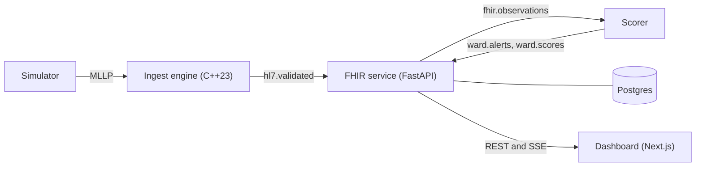

# WardWatch

WardWatch is a hospital early warning pipeline built end to end: it takes HL7 v2 messages from bedside monitors and labs, stores them as FHIR R4, scores every patient each hour with NEWS2 and a sepsis model, and puts the alerts in front of clinicians with the reasons behind them and a workflow to act on them.

The problem it works on is sepsis on the ward. Deterioration shows in vital signs and labs hours before it is obvious, but the scores wards use today (NEWS2 in the UK) are simple point tables, and a model that alerts more often is not useful if nobody trusts or acts on the alerts. So the evaluation here asks a narrower question than "is the model accurate": at the same number of alerts per patient-day as NEWS2, does it find more septic patients, earlier, at a hospital it was not trained on?

All patient data is simulated or de-identified public research data. This is not a medical device.

## Architecture



- The ingest engine is a C++23 MLLP server: a zero-copy HL7 parser, validation against a LOINC table, original-mode ACKs, and a Kafka sink. One I/O thread and one validation thread share lock-free rings, and a slow sink pushes back on senders through TCP instead of buffering.
- The FHIR service converts validated messages to Patient, Encounter and Observation resources, serves a FHIR read API and the ward API, and runs the alert workflow (acknowledge, escalate, resolve) with optimistic locking and an append-only audit table.
- The scorer buckets observations into ICU hours, computes NEWS2 and the calibrated model probability with the same code the offline evaluation uses, applies the alert policy, and attaches the top five SHAP factors to each alert.
- The dashboard shows the ward, each patient's vitals and NEWS2 timeline, and the alert inbox, with live updates over Server-Sent Events.

Kafka topics carry JSON whose schemas live in `contracts/`. More detail is in [docs/architecture.md](docs/architecture.md), and the HL7 to FHIR field mapping in [docs/hl7-fhir-mapping.md](docs/hl7-fhir-mapping.md).

## Running the demo

You need Docker with Compose v2.

```
make demo
```

This builds the images, starts Postgres, Kafka, ingest, the FHIR service, the scorer, the dashboard, Prometheus and Grafana, then starts the simulator. It prints:

- the dashboard at http://127.0.0.1:3000
- Grafana at http://127.0.0.1:3001 (pipeline, latency and alerting dashboards)
- the FHIR API at http://127.0.0.1:8000/fhir/metadata

On a clean clone the simulator replays the three committed fixture stays, one of which deteriorates within hours, and the scorer runs NEWS2 only. For a full ward and the sepsis model, run `make data` and `make train` first. `make down` stops the stack and removes its volumes. Every port binds to 127.0.0.1.

Without Docker, `make frontend-test-e2e-local` runs the same pipeline as local processes (`scripts/local_stack.sh`) and drives it with Playwright. The compose files have been checked with `docker compose config` and by `python/tests/unit/test_infra.py`, but the machine this was built on had no running Docker daemon, so `make demo` itself was exercised only through the CI jobs `stack-smoke` and `frontend-e2e`, not locally.

## Reproducing the evaluation

```
make setup   # toolchains into .tools/, Python and Node dependencies
make data    # PhysioNet 2019 into data/physionet, Synthea identities into data/synthea
make eval    # ml/reports/<run_id>/: metrics.json, summary.md and plots
make train   # the serving bundle in ml/artifacts/<model_version>/
make check   # lint, types, unit and integration tests, sanitizers and coverage gates
```

`make eval` took 857 s on an Apple M3. The protocol is in [docs/evaluation.md](docs/evaluation.md): train on one hospital system, test on the other, with every threshold and calibrator chosen on the training site only.

## Results

From `ml/reports/20260930T064627Z-7e389a1/summary.md`, produced by `make eval`. Intervals are 95% patient-level bootstrap intervals (1000 resamples). NEWS2 is computed with two proxies that make it look worse than at a real bedside; see Limitations.

Train on site A, test on site B (20000 stays):

| Model | AUROC | AUPRC |
|---|---|---|
| XGBoost | 0.801 (0.790 to 0.812) | 0.076 (0.068 to 0.087) |
| GRU | 0.785 (0.772 to 0.797) | 0.084 (0.073 to 0.097) |
| NEWS2 | 0.679 (0.668 to 0.693) | 0.033 (0.030 to 0.037) |

| Model and operating point | Septic stays alerted | Median lead h (IQR) | Alerts per patient-day | PPV per alert |
|---|---|---|---|---|
| XGBoost, matched to NEWS2 burden | 0.939 (0.923 to 0.955) | 35.0 (15.3 to 45.0) | 1.32 | 0.100 |
| XGBoost, 80% sensitivity on site A | 0.668 (0.637 to 0.698) | 34.5 (12.0 to 45.0) | 0.42 | 0.222 |
| NEWS2 >= 5 | 0.828 (0.804 to 0.853) | 30.0 (12.0 to 43.0) | 1.28 | 0.075 |

Train on site B, test on site A (20336 stays): AUROC 0.785 for XGBoost, 0.734 for the GRU and 0.653 for NEWS2. At matched burden XGBoost alerts 0.965 of septic stays at 2.29 alerts per patient-day against NEWS2's 0.908 at 2.08.

What transfers badly between hospitals is the threshold. The 80% sensitivity point chosen on site A reaches 0.668 on site B, and the matched-burden threshold gives a different alert rate on each site. Raw scores are poorly calibrated on the new site (ECE 0.288 for XGBoost from A to B) and Platt scaling fitted on the training site brings that to 0.0023. XGBoost is the served model: it has the higher AUROC and utility in both directions and the explanation path.

## Ingest throughput

Measured on an Apple M3 (8 cores, macOS), Release build.

| Measurement | Value | Source |
|---|---|---|
| Parse one 13-OBX ORU^R01 (single core, median of 5) | 301k messages/s | `make bench`, `ingest/bench/results/micro-release.json` |
| Parse and validate | 120k messages/s | same |
| Parse, validate and serialize to JSON | 62k messages/s | same |
| End to end over MLLP, 32 connections, null sink | 31.3k messages/s acknowledged AA; ACK latency p50 0.78 ms, p99 2.6 ms | `wardwatch-sim load --rate 100000 --duration 15 --connections 32`, `ingest/bench/results/e2e-load-null-sink.json` |

The end to end figure is limited by the single-process Python load generator running on the same machine: 16 connections gave the same rate.

## Alert latency

From the MSH-7 time of the newest message in a scored hour to the scorer publishing that hour's alert, over 231 alerts from 12 beds of real PhysioNet stays replayed at the default 2 seconds per ICU hour: 189 within 2 s and 229 within 5 s, p50 1.6 s and p99 5.0 s (interpolated inside the histogram's 1 to 2 s and 2 to 5 s buckets). Measured with `scripts/measure_latency.py` against the pipeline from `scripts/local_stack.sh` on one Apple M3; the result and the exact setup are in `ingest/bench/results/e2e-msh7-to-alert-local-stack.json`.

No alert arrives in under a second because an hour is scored only once it has closed: when the next hour's first result arrives, or after one second with nothing new for that patient. At the demo clock that wait, not processing, is most of the latency.

## Design decisions worth knowing

- Every stage is at least once and every write is idempotent. The ingest engine ACKs only after the sink accepts a message, the FHIR service commits Kafka offsets only after its database commit, and resource and alert IDs are derived from the message content, so a redelivery rewrites the same rows.
- The alert policy is shared code. The offline evaluation and the online scorer call the same feature, NEWS2 and policy functions, and a parity test holds online scores to within 1e-6 of offline ones.
- Operating points are chosen on the training site and never touched on the test site; a leakage check in every evaluation run confirms it.
- A model alert must explain itself: each carries its calibrated probability, the NEWS2 breakdown and the top five factors in plain language ("Respiratory rate up 8/min over 6 h").
- Alert writes use ETags. Two clinicians acting on the same alert get a 412 for the second, with who changed it, instead of a silent overwrite.
- MSH-7 carries the real send time while clinical times run on the simulator's accelerated clock, so the MSH-7 to alert latency (`wardwatch_msh7_to_alert_publish_seconds`) is a wall-clock measurement.

The full log of decisions and the reasons for them is in [PROGRESS.md](PROGRESS.md).

## Limitations

- The data is simulated. Physiology comes from PhysioNet ICU stays replayed as if they were a ward, and identities come from Synthea. Real ward data would differ in case mix, measurement frequency and alert rates.
- NEWS2 uses proxies. PhysioNet has no consciousness field (every hour is scored as Alert) and no oxygen delivery field (supplemental oxygen is FiO2 above 0.21), and unmeasured parameters score 0. All of these lower NEWS2, so the comparison likely flatters the model.
- The sepsis label is the challenge's retrospective Sepsis-3 based label, and the evaluation covers two hospital systems, not many.
- There is no authentication. Clinicians type their name to act on an alert, and the API trusts it.
- It has not been evaluated prospectively or with clinicians, and it is not a medical device.

## Continuous integration

GitHub Actions runs the C++ release build and tests, ASan with UBSan, TSan, 60 seconds of fuzzing per target, Python lint and types, unit and integration tests, an ML smoke run on fixtures, frontend lint, typecheck and unit tests, the image builds, the compose smoke test, Playwright against the compose stack, prose lint and the coverage gates. The `ci-passed` job depends on all of them; make it the required check in branch protection.

## Data licensing and citation

PhysioNet/Computing in Cardiology Challenge 2019 data is used under the Creative Commons Attribution 4.0 International licence. Cite:

- Reyna, M., Josef, C., Jeter, R., Shashikumar, S., Moody, B., Westover, M. B., Sharma, A., Nemati, S., and Clifford, G. D. (2019). Early Prediction of Sepsis from Clinical Data: The PhysioNet/Computing in Cardiology Challenge 2019 (version 1.0.0). PhysioNet.
- Goldberger, A., Amaral, L., Glass, L., Hausdorff, J., Ivanov, P. C., Mark, R., Mietus, J. E., Moody, G. B., Peng, C. K., and Stanley, H. E. (2000). PhysioBank, PhysioToolkit, and PhysioNet: Components of a new research resource for complex physiologic signals. Circulation, 101(23), e215 to e220.

Synthea is Apache 2.0 licensed software from The MITRE Corporation. Cite: Walonoski, J., et al. (2018). Synthea: An approach, method, and software mechanism for generating synthetic patients and the synthetic electronic health care record. Journal of the American Medical Informatics Association, 25(3), 230 to 238.

Neither dataset is committed to this repository; `make data` downloads PhysioNet and generates the Synthea population with a fixed seed.

WardWatch itself is MIT licensed; see [LICENSE](LICENSE).
