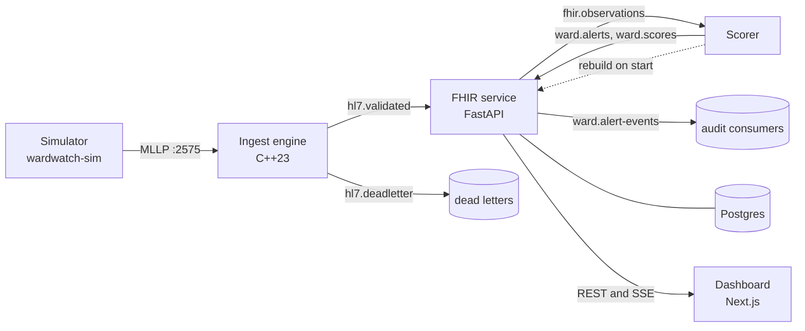

# Architecture

WardWatch takes HL7 v2 messages from bedside and lab systems, stores them as FHIR R4, scores every patient each ICU hour with NEWS2 and a sepsis model, and puts the resulting alerts in front of clinicians. Each stage is a separate process joined by Kafka topics whose payloads are fixed by JSON Schemas in `contracts/`.

## Topics

| Topic | Producer | Consumer | Key | Payload |
|---|---|---|---|---|
| `hl7.validated` | ingest | FHIR service | MRN | Decoded segments, the MRN and the raw message |
| `hl7.deadletter` | ingest, FHIR service | none in the stack | MRN or control ID | The raw bytes, error code, stage (`ingest` or `fhir`) |
| `fhir.observations` | FHIR service | scorer | MRN | One stored Observation with its encounter and admission time |
| `ward.alerts` | scorer | FHIR service | MRN | An alert with NEWS2 components, probability and top factors |
| `ward.scores` | scorer | FHIR service | MRN | Every scored ICU hour, alerting or not |
| `ward.alert-events` | FHIR service | none in the stack | alert ID | Each workflow transition, for audit |

Keying by MRN keeps each patient's records in order within a partition. The schemas and an example of each payload are in `contracts/schemas/` and `contracts/examples/`, and a test validates every example against its schema.

## Ingest engine (`ingest/`)

A C++23 MLLP server. One I/O thread owns every socket (epoll on Linux, kqueue on macOS) and frames messages; a validation thread parses, validates, publishes to the sink and hands ACKs back. The two threads share single-producer single-consumer rings, one in each direction, and an eventcount so neither spins when idle.

- The parser is zero-copy: segments and fields are views into the received frame.
- Validation checks structure, required segments and fields, encoding characters, timestamps and duplicate control IDs, and checks each OBX against the LOINC table (`contracts/loinc_codes.json`). An unknown code or a value outside the table's plausible range is a warning attached to the accepted message, so one odd result does not reject a whole hourly message. Parse and structural errors ACK with AR, content errors with AE, and each code is counted in Prometheus. The codes are listed in `contracts/fault_catalog.json`.
- A message is ACKed with AA only after the sink accepts it. The Kafka sink uses an idempotent librdkafka producer (acks=all). If the sink refuses a record, no ACK is sent, so the sender times out and retries; a resent message with an already-seen control ID and identical bytes is treated as a retransmission.
- When the sink falls behind, the inbound ring fills and the I/O thread stops reading from sockets, so TCP pushes back on the senders instead of the server buffering without bound.
- Stopping drains the ring, flushes the sink and writes the outstanding ACKs before closing sockets.

It is tested with unit and integration suites, AddressSanitizer with UBSan, ThreadSanitizer, three libFuzzer targets (framer, parser, escapes) and Google Benchmark. Throughput figures are in the README.

## FHIR service (`python/fhir_service/`)

FastAPI with async SQLAlchemy on Postgres, and Alembic migrations.

- The `hl7.validated` consumer converts each message to Patient, Encounter and Observation resources (`docs/hl7-fhir-mapping.md`), upserts them, then publishes each new Observation to `fhir.observations`. Offsets are committed only after the database commit, so delivery is at least once; resource IDs are derived from the message, so a redelivery rewrites the same rows instead of adding new ones. A message that cannot be converted goes to `hl7.deadletter` with `stage=fhir`.
- The `ward.alerts` consumer stores alerts in state `open`; alert IDs are UUIDv5 of encounter, hour and source, so a republished alert is stored once. The `ward.scores` consumer stores every scored hour for the census and the NEWS2 timeline.
- The alert workflow is a state machine (`open` to `acknowledged` or `escalated`, `acknowledged` to `escalated` or `resolved`, `escalated` to `resolved`). Writes need `If-Match` with the alert's ETag: a stale ETag gets 412 and an impossible transition 409, both with the alert as it is now. Every transition is written to the append-only `alert_events` table, which a database trigger protects from updates and deletes, and published to `ward.alert-events`. A background job escalates alerts left open too long, as actor `system`.
- The FHIR read API (`/fhir/metadata`, `/fhir/Patient`, `/fhir/Observation` with date prefixes, sorting and paging) returns `searchset` Bundles and `OperationOutcome` errors. The ward API serves the census, a patient's vitals and scores, the alert list and actions, and a Server-Sent Events stream of vitals, score and alert changes.
- `/healthz`, `/readyz` (database and Kafka) and `/metrics`.

## Scorer (`python/scorer/`)

The scorer consumes `fhir.observations`, buckets each result into its ICU hour (hour k covers the k-th hour after admission, as in PhysioNet), and closes an hour when a later hour's result arrives or when nothing new has come for that encounter for a second. For each closed hour it builds the same causal features as the offline pipeline, computes NEWS2 and the calibrated model probability, runs the shared alert policy, and publishes to `ward.scores` and, when the policy fires, `ward.alerts` with the top five SHAP factors. Without a serving bundle it runs NEWS2 alone and says so at startup.

The online and offline paths share `wardwatch_ml`, and a parity test replays fixture stays through the online path and requires the scores to match the offline pipeline within 1e-6. On restart the scorer rebuilds each admitted patient's window and alert policy state from the FHIR API before it consumes new records, so a restart mid-stay produces the same subsequent alerts.

## ML pipeline (`python/ml/`)

`wardwatch-ml` loads PhysioNet, builds features, trains XGBoost and a GRU, calibrates, chooses operating points and evaluates across the two hospital systems. `make train` writes the serving bundle the scorer loads (`ml/artifacts/<model_version>/`: model, calibrator, thresholds, feature spec, data fingerprint, git SHA). The protocol and results are in `docs/evaluation.md`.

## Simulator (`python/simulator/`)

`wardwatch-sim replay` admits PhysioNet stays to a ward of beds, gives each a Synthea identity through a seeded mapping, and sends ADT^A01, hourly ORU^R01 and ADT^A03 messages over MLLP on an accelerated clock (2 seconds per ICU hour by default). MSH-7 carries the wall-clock send time, so the end to end latency metric is measured on the real clock; the clinical times go in PV1-44, OBR-7 and OBX-14. It can damage a chosen share of messages with each fault from the fault catalog. `wardwatch-sim load` measures ingest throughput.

## Dashboard (`frontend/`)

Next.js with the App Router, TanStack Query and Recharts, with types generated from the FHIR service's OpenAPI schema. The browser reaches the FHIR service through a rewrite of `/api/*`, so there is no cross-origin setup. It shows the ward board, a patient view with vitals charts, alert markers and the NEWS2 timeline, and the alert inbox with the acknowledge, escalate and resolve workflow. Updates are optimistic and roll back on failure, and the SSE stream refetches whatever an event makes stale.

## Observability

Prometheus scrapes ingest (`:9464`), the FHIR service (`:8000/metrics`) and the scorer (`:9465`). Grafana is provisioned with three dashboards in `infra/grafana/dashboards/`: pipeline (throughput, rejects by code, ring occupancy, consumer lag), latency (MSH-7 to alert publish as a histogram, plus per-stage timings) and alerting (alerts per patient-day, open alerts, time to acknowledge).

The end to end latency is `wardwatch_msh7_to_alert_publish_seconds`: from the MSH-7 of the newest message in a scored hour to the scorer publishing that hour's alert.

## Deployment

`infra/docker-compose.yml` runs Postgres, Kafka in KRaft mode, a topic initialiser, ingest, the FHIR service, the scorer, the dashboard, Prometheus and Grafana, with the simulator under the `demo` profile. Every service has a healthcheck and starts only after what it depends on is healthy. Every published port binds to 127.0.0.1. `scripts/local_stack.sh` runs the same pipeline as local processes for machines without Docker.

| Port | Service |
|---|---|
| 2575 | ingest MLLP |
| 9464 | ingest metrics |
| 8000 | FHIR service |
| 9465 | scorer metrics |
| 3000 | dashboard |
| 9090 | Prometheus |
| 3001 | Grafana |
| 5432 | Postgres |
| 9092 | Kafka |
